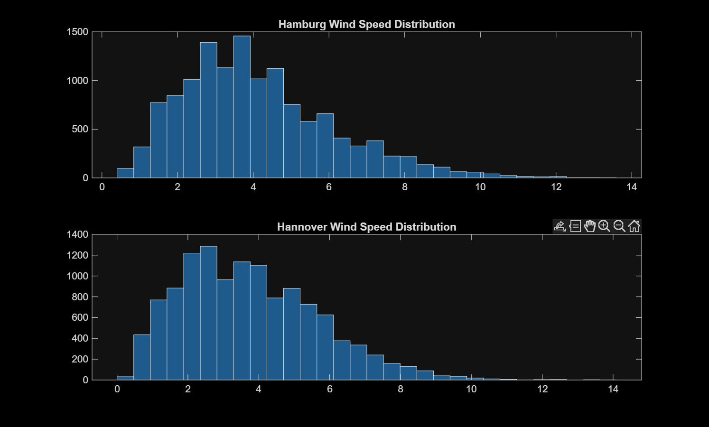
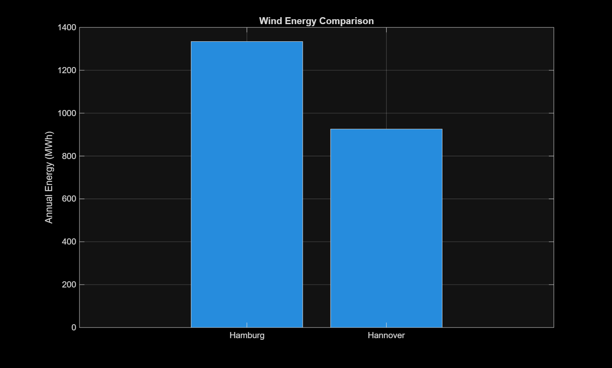
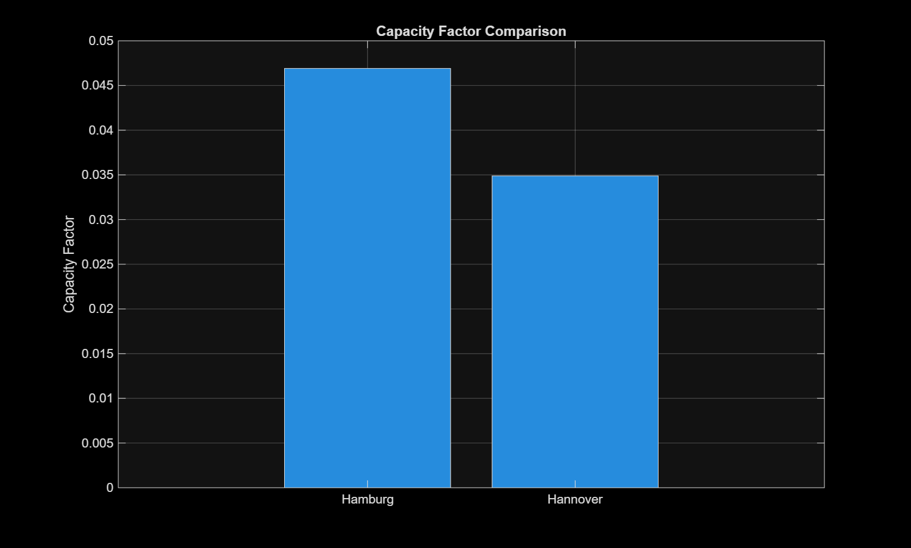

# Wind Energy Simulation Project

## Overview
This project analyzes real wind data from Hamburg and Hannover (Germany) to estimate wind turbine energy production.

## Methodology
- Data preprocessing
- Wind turbine modeling
- Power calculation
- Annual energy estimation
- Capacity factor comparison

## Results
Hamburg shows higher energy production due to stronger wind conditions.

## Tools# Wind Energy Simulation Project (Germany)

## Overview
This project analyzes real wind data from Hamburg and Hannover to estimate wind turbine energy production.

## Methodology
- Data cleaning and preprocessing
- Wind turbine power curve modeling
- Energy production estimation (AEP)
- Capacity factor calculation
- Comparison between two locations

## Results
Hamburg shows higher energy production d

ue to stronger wind conditions.

## Tools
- MATLAB
- ## Results

### Wind Distribution

### Energy Comparison

### Capacity Factor

## Author
Amirhossein Khanamoopour
MATLAB
